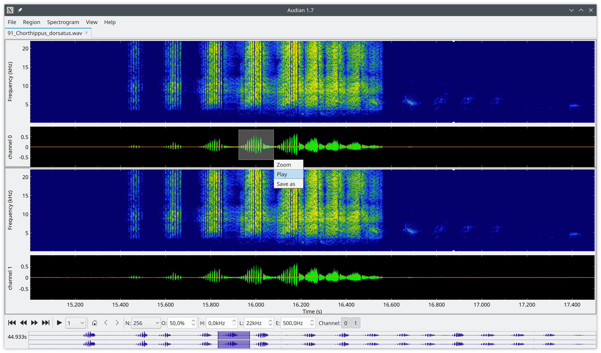

[](https://pypi.python.org/pypi/audian/)
[](https://badge.fury.io/py/audian)

# audian - AUDIoANalyzer

Python-based GUI for viewing and analyzing recordings of animal
vocalizations.



## Features

- Interactive viewer for single and multi-channel audio signals.
- Can handle many file formats and long recordings - holds only part of the recordings in memory.
- Displays raw traces, filtered traces, envelopes, and spectrogram.
- Change spectrogramm resolution and overlap interactively.
- Change spectrogram color bar range and color map on the fly.
- Change low- and high-pass filter cutoff frequencies interactively.
- Optional envelope with lowpass-filter cutoff frequency that can be changed interactively.
- Hide and show channels and plot panels.
- Extensive and intuitive key shortcuts for most functions.

## New pyqtgraph based version

New implementation of `audian` based on
[pyqtgraph](https://pyqtgraph.readthedocs.io).

``` sh
audiangui data.wav
```

I currently explore various possibilities for interactive analysis of
audio signals. In the end, audian should be easily extensible via
plugins that provide processing and analysis algorithms, and audian
handles all GUI aspects.

### Incomplete list of TODOs:

- [ ] Implement Model-View structure
  - [x] Handle all data (raw, filtered, spectrogram,...) in one class!
  - [x] Boil down the BufferedData code to a simple plugin interface.
  - [x] Add destination list to Buffered data.
  - [x] Smart updates of trace buffers.
  - [x] Move spectrum functions from Data to BufferedSpectrum.
  - [ ] Move y-lim functions from TracItem and SpecItem to the respective plot classes.
  - [ ] Traces should be hideable and assignable to plots.
  - [ ] TraceItems should get color and line width from data objects.
  - [ ] Recompute derived data only if visible or used by something visible.
  - [ ] Automatically discover plugins. 
  - [ ] Test this plugin interface with
    - [ ] Subtract common mean
    - [ ] Logarithmic and high-pass filtered envelope
    - [ ] Envelope from visible frequency range of spectrogram
    - [ ] Feature expansion (kernel filter)
  - [ ] Add events and marker ranges to the Data class
    - [ ] Load events from csv files provide along with the raw data.
  - [ ] Provide interface for event detectors
  - [ ] Provide interface for event filters?
- [ ] Implement a proper layout for showing the plot panels:
  - [ ] support optional grid layout
  - [ ] support additional plots from plugins
- [ ] New plot widget showing power spectrum of visible range
  or slice at current cursor position. Cycle with Ctrl+P through no power plot, color bar, power spectrum to the right, power spectrum on top.
- [ ] FullTracePlot:
  - [ ] fix offset problem.
  - [ ] indicate time under mouse cursor.
- [ ] Add a toolbar widget for spectrum overlap
- [x] SpinBox for envelope cutoff frequency needs to show digits
  after decimal point.
- [ ] Interactive high- and low-pass filtering:
  - [ ] high- and low-pass filter lines must not cross! Update limits.
  - [ ] add a toolbar widget for setting filter order.
- [ ] Implement downsampling of spectrograms! Or make it even dependent on window size.
- [ ] Improve on the concept of current cursor:
  - [ ] play should not stop at visible range but keeps going and scrolls data.
  - [ ] make cursor moveable by mouse.
  - [ ] some key shortcuts for moving and handling cursor.
- [ ] Improve on marking cross hair, cues, regions, events:
  - [ ] Cross hair should only be used for measuring! Just a single whitish color.
    Comments only in the table.
    Show points only fom active measurement.
  - Cues and regions have position data with labels. Same for all channels.
    - visualize them by infinite vertical lines/regions, both in plots and
      FullTracePlot (maybe in extra row?).
    - can be set from cursor position/marked region.
    - add key shortcuts to go to next/previous cue.
    - from cue table go to selected cue.
    - how does boris export them?
  - Events are channel specific points.
    - Plotted as dot at data amplitude.
    - Many events per label.
    - Result from some analysis.
    - But should be editable.
  - Event regions are channel specific:
    - Plotted as lines on top of data.
    - Result from some analysis.
    - But should be editable.
- [ ] Define plugin interfaces for analysis on full data, visible range,
  selected range.
- [ ] Have a dockable sidebar for showing metadata, cue tables etc.


### Structure

Eventually we want audian to be neatly separated into a data model,
widgets that display the data, and controllers.

#### Model

At the core of audian are time-series data that are loaded from a
file. In addition it supports varous derived time-series data, like
for example filtered data, computed envelopes, spectrograms,
etc. Audian can handle very large data sets, but holds only a small
part in memory (buffer).

- `class BufferedData`: Base class for computed data (`buffereddata.py`).
- `class BufferedFilter`: Filter source data on the fly (`bufferedfilter.py`).
- `class BufferedEnvelope`: Compute envelope on the fly (`bufferedenvelope.py`).
- `class BufferedSpectrogram`: Spectrogram of source data on the fly (`bufferedspectrogram.py`).

- `class Data`: Handles all the raw data traces, filtered traces, spectrogram data, etc (`data.py`).

- `markerdata.py`: All marker related stuff. TODO: Split it into widgets and marker data.

#### View

All the data audian is dealing with are displayed in plots.

A few classes specializing some pyqtgraph features:

- `timeaxisitem.py`: Label time-axis of OscillogramPlot and SpectrumPlot.
- `yaxisitem.py`: Label y-axis of OscillogramPlot and SpectrumPlot.
- `selectviewbox.py`: Handles zooming and selection on OscillogramPlot
  and SpectrumPlot.

Basic plots for time-series data:

- `timeplot.py`: Panel for displaying any data as a function of time.
- `spectrumplot.py`: PlotItem for interactive display of spectrograms.

Basic plot items:

- `traceitem.py`: PlotDataItem for OscillogramPlot.
- `specitem.py`: ImageItem for SpectrumPlot.
- `fulltraceplot.py`: GraphicsLayoutWidget showing the full raw data traces.

#### Controller

- `audiangui.py`: Main GUI, handles DataBrowser widgets and key shortcuts.
- `databrowser.py`: Each data file is displayed in a DataBrowser widget.


## Old matplotlib-based version

Not further developed. As soon as audiangui is able to show power
spectra of both raw traces and envelopes, this script will be removed from the repository.

Simply run it from a terminal:
``` sh
audian data.wav
```

or call it from a script (see `runfile.py`):

``` py
import audian

filepath = 'data.wav'
high_pass = 500.0
audian.main(['-f', f'{high_pass}', filepath])
```

### Installation of audiangui in Anaconda3 on windows

Anaconda supports really old versions of PyQt5 and Qt5 only that are
not compatible with a recent pyqtgraph. No fun.

A workaround is to first create a new conda environment. For this open
the windows powershell from the Anaconda navigator. Type in and execute
``` sh
conda create -n Qt python=3.9
```
Then activate the new `Qt` environment:
``` sh
conda activate Qt
```
Then we use `pip` to install PyQt5:
``` sh
pip install PyQt5
```
Change into a directory where you want to put audioio and audian. First, download audioio and install it:
``` sh
git clone https://github.com/janscience/audioio.git
cd audioio
pip install .
cd ..
```
And then do the same with audian:
``` sh
git cone https://github.com/bendalab/audian.git
cd audian
pip install .
```
This installs many other packages (numpy, scipy, etc.).

Then you should be able to run `audiangui` from the power shell

For updating audian do
``` sh
cd audian
git pull origin master
pip install .
```
Same for audioio.


## Run Audian from Spyder IPython console:

In the IPython console do:
``` py
%set_env MPLBACKEND=
! audian -f 1000 -l 15000 data.wav
```

## Installation

Simply run (as superuser):
```
pip install audian
```

This should also install:
- [ThunderLab](https://github.com/bendalab/thunderlab)
- [AudioIO](https://github.com/bendalab/audioio)


## Options

Output of `audian --help`:

``` txt
usage: audian [-h] [--version] [-v] [-c [cfgfile]] [-f FREQ] [-l FREQ] [file] [channel]

Display waveform, spectrogram, power spectrum, envelope, and envelope spectrum of time series data.

positional arguments:
  file                  name of the file with the time series data
  channel               channel to be displayed

optional arguments:
  -h, --help            show this help message and exit
  --version             show program's version number and exit
  -v                    print debug information
  -c [cfgfile], --save-config [cfgfile]
                        save configuration to file cfgfile (defaults to /usr/local/bin/audian.cfg)
  -f FREQ               cutoff frequency of highpass filter in Hz
  -l FREQ               cutoff frequency of lowpass filter in Hz

version 1.0 by Jan Benda (2015-2022)
```

## Other scientific software for working on timeseries data

- [BioSPPy](https://github.com/scientisst/BioSPPy): The toolbox
  bundles together various signal processing and pattern recognition
  methods geared towards the analysis of biosignals.
  

